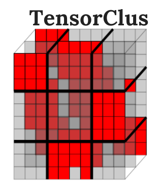

Welcome to TensorClus's documentation!
========================================

.. image:: https://readthedocs.org/projects/tensorclus/badge/?version=latest
   :target: https://tensorclus.readthedocs.io/en/latest/?badge=latest

.. image:: https://badge.fury.io/py/TensorClus.svg
    :target: https://badge.fury.io/py/TensorClus

**TensorClus**  (Tensor Clustering) is a first Python library aiming to clustering and co-clustering of tensor data. It allows to easily perform tensor clustering trought decomposition or tensor learning and tensor algebra. TensorClus allows easy interaction with other python packages such as NumPy, Tensorly, TensorFlow or TensorD, and run methods at scale on CPU or GPU.

It supports major operating systems namely Microsoft Windows, MacOS, and Ubuntu.

**TensorClus** is distributed under the 3-Clause BSD license. It works with  Python>= 3.5.

.. note::  If you use this software as part of your research, please cite: `Rafika Boutalbi, Lazhar Labiod, Mohamed Nadif. TensorCLus: A Python Library for Tensor Co-clusteri.`

.. toctree::
   :maxdepth: 1

   install
   examples
   api/index

